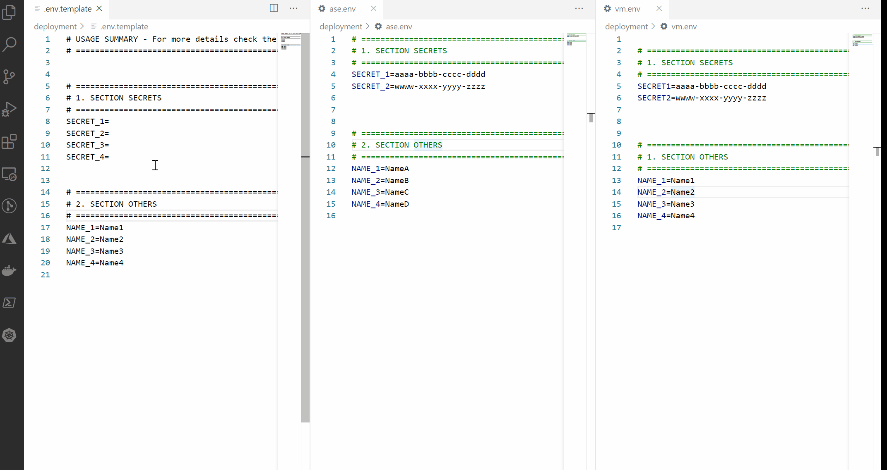
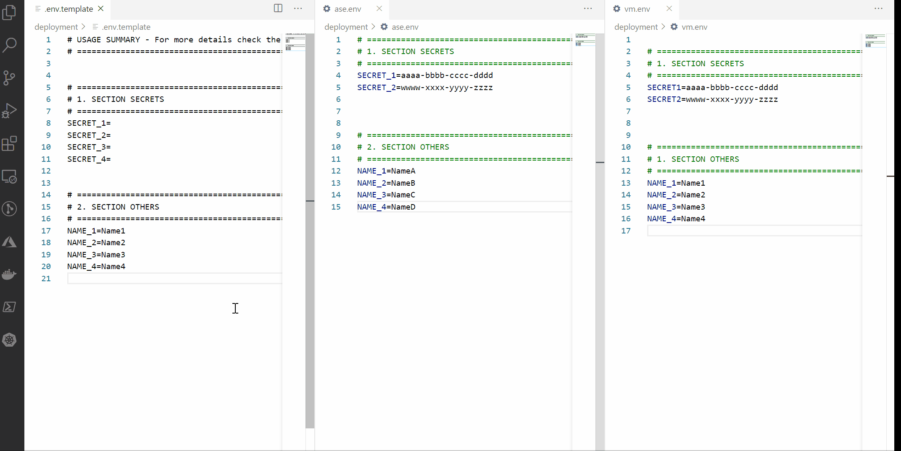
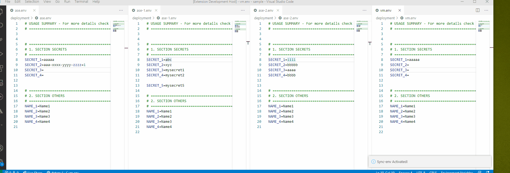
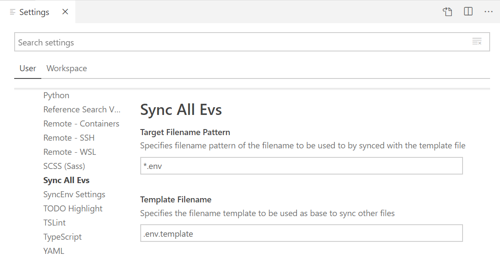

# SYNC ALL ENVS

```
  / ____\ \   / / \ | |/ ____|     /\   | |    | |      |  ____| \ | \ \    / / ____|
 | (___  \ \_/ /|  \| | |         /  \  | |    | |      | |__  |  \| |\ \  / / (___  
  \___ \  \   / | . ` | |        / /\ \ | |    | |      |  __| | . ` | \ \/ / \___ \ 
  ____) |  | |  | |\  | |____   / ____ \| |____| |____  | |____| |\  |  \  /  ____) |
 |_____/   |_|  |_| \_|\_____| /_/    \_\______|______| |______|_| \_|   \/  |_____/ 
```

SYNC ALL ENVS is an extension that helps you sync all your *.env files based on a template.

## Features

There are 3 commands available on this extension:

### 1. Sync ALL *.env files

This function allows you to sync all your *.env files in your working directory with the .env template.



### 2. Sync selected *.env file

This function allows you to sync only a selected *.env file in your working directory with .env template.



### 3. Sync family .env files

This function allows you to sync files from the same family (root name).

- `x.env`: _x_ is the family root name
- `x-1.env`: belongs to family _'x'_

To create families, keep the same root name and separate the name with a '-'.

**Example:**
In a repo where there are the following files:

```
ex.env  ex-1.env  ex-2.env  ase.env   ase-local.env
```

There are 2 families: `ex and ase` and `ex.env and ase.env` are the parents of these families.

After selecting which family to sync, the family files will be synced with the .env parent file of that family



## Requirements

The template env file and the target files must be located on the working directory.

By default, the template env file is named `.env.template`. This can be changed to a different template file on the extension settings.

By default, the target env filename pattern is `*.env`. Therefore any file with this pattern except `.env` will be used for syncing. This can be changed to a different pattern file name on the extension settings. This means that files with names such as `vm.env`, `machine1.env` and `deployment.env` will be found by the extension.

## Extension Settings

This extension contributes the following settings:

* `syncallenvs.templateFilename`: specifies the filename template to be used as base to sync other files, by default the template filename is `.env.template`

* `syncallenvs.targetFilenamePattern`: specifies filename pattern of the filename to be used to by synced with the template file, by default the target filename pattern is `*.env`



## Release Notes

### 0.0.1

Initial release of SyncAllEnvs with sync all \*.env files, sync selected \*.env file and allowing user to customize template env file and target env files pattern

### 0.0.2

Fixing bug where values with `=` were cut off because it matched separator

### 0.0.3

Adding capability to sync family .env files


-----------------------------------------------------------------------------------------------------------

**Enjoy!**
